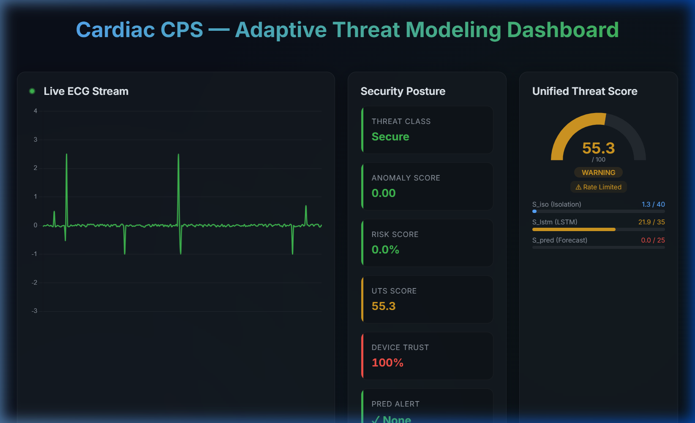

# Cardiac CPS — Adaptive Threat Modeling & Predictive Security System

> An advanced, real-time Cyber-Physical System (CPS) for cardiac monitoring that fuses physiological telemetry with an **Adaptive Threat Modeling & Predictive Security Architecture (ATM-PSA)** — detecting, classifying, and predicting adversarial attacks on medical IoT devices.



---

## Table of Contents

1. [Overview](#overview)
2. [System Architecture](#system-architecture)
3. [ATM-PSA Framework](#atm-psa-framework)
4. [Module Reference](#module-reference)
   - [Backend Core](#backend-core)
   - [ATM-PSA Modules](#atm-psa-modules)
   - [ML / LSTM Inference Service](#ml--lstm-inference-service)
   - [Frontend Dashboard](#frontend-dashboard)
5. [API Reference](#api-reference)
6. [Dashboard Panels Explained](#dashboard-panels-explained)
7. [Attack Taxonomy](#attack-taxonomy)
8. [Threat Score Calculation (UTS)](#threat-score-calculation-uts)
9. [Getting Started (Local Dev)](#getting-started-local-dev)
10. [Docker Deployment](#docker-deployment)
11. [Project Structure](#project-structure)
12. [Technical Stack](#technical-stack)

---

## Overview

This project simulates a **hospital-grade cardiac monitoring Cyber-Physical System** under active cyber-threat. It:

- **Streams** synthetic ECG and vital-signs telemetry from a simulated medical device
- **Extracts** 20 temporal and network-layer features per 30-reading window
- **Scores** each window using a Hybrid LSTM-Autoencoder anomaly detector (`S_lstm`) and Isolation Forest (`S_iso`)
- **Forecasts** future vital-sign trajectories 5 steps ahead with uncertainty bounds (`S_pred`)
- **Unifies** all scores into a **Unified Threat Score (UTS)** via the CADRE risk engine
- **Classifies** detected attacks against a 7-class MITRE ICS taxonomy
- **Evaluates** model robustness against FGSM, PGD, and temporal perturbation adversarial attacks
- **Visualises** everything on a live React dashboard with ECG waveform, gauges, forecast charts, and device trust tables

---

## System Architecture

```
┌─────────────────────────────────────────────────────────┐
│                   SIMULATION LAYER                      │
│   simulate_stream.py — Medical device telemetry         │
│   Injects: FDI, DoS, Device Spoofing attacks (~10%)     │
└────────────────────┬────────────────────────────────────┘
                     │  POST /predict  (every 2s)
                     ▼
┌─────────────────────────────────────────────────────────┐
│               BACKEND (FastAPI :8000)                   │
│                                                         │
│  main.py ─► app/api/routers.py                          │
│    │  ├─ SecurityAnomalyDetection → anomaly_score       │
│    │  ├─ ThreatModelLogic → threat_type, mitigation     │
│    │  └─ LSTMLogic → device_risk                        │
│    │                                                     │
│    └─ api_extensions.py (ATM-PSA pipeline)              │
│         ├─ TemporalExtractor → 30×20 feature window     │
│         ├─ _try_lstm() → S_lstm, S_pred, forecast       │
│         ├─ _try_cadre() → UTS, severity, action         │
│         ├─ classify_attack() → MITRE class              │
│         └─ dashboard_state{} (in-memory, polled)        │
│                                                         │
│  SQLite DB: medical_cps.db                              │
│    ├─ sensor_events                                     │
│    ├─ threat_incidents                                  │
│    ├─ threat_model_state (per-device trust)             │
│    └─ prediction_log (ATM-PSA audit trail)              │
└────────┬──────────────────────────┬────────────────────┘
         │ GET /incidents           │ GET /api/dashboard
         │ GET /api/threat-model-state  GET /api/resilience
         ▼                          ▼
┌─────────────────────────────────────────────────────────┐
│           FRONTEND (React + Vite :3000)                 │
│  src/App.jsx — main dashboard                           │
│    ├─ Live ECG waveform (synthetic, 50fps)              │
│    ├─ Security Posture (6 metric cards)                 │
│    ├─ UTS Doughnut Gauge + Score Bars                   │
│    ├─ HR Forecast Line Chart (5-step)                   │
│    ├─ Session Resilience Stats                          │
│    ├─ Device Trust Table                                │
│    └─ Security Event Log                               │
└─────────────────────────────────────────────────────────┘

Optional Microservices (Docker only):
  lstm_inference :8001  — PyTorch LSTM-AE model server
  cadre_engine   :8002  — Dedicated CADRE REST API
```

---

## ATM-PSA Framework

The **Adaptive Threat Modeling & Predictive Security Architecture (ATM-PSA)** is the core innovation of this project. It processes every 30-reading telemetry window through four stages:

### Stage 1 — Temporal Feature Extraction (`temporal_extractor.py`)

When the buffer reaches 30 readings, a **20-dimensional feature vector** is computed for each time step, producing a `(30, 20)` numpy array. Features are grouped into four categories:

| Index | Feature | Category | Description |
|-------|---------|----------|-------------|
| 0 | `hr_bpm` | Raw Vitals | Heart Rate (bpm) |
| 1 | `spo2_pct` | Raw Vitals | Blood Oxygen Saturation (%) |
| 2 | `rr_bpm` | Raw Vitals | Respiratory Rate (bpm) |
| 3 | `sbp_mmhg` | Raw Vitals | Systolic Blood Pressure |
| 4 | `dbp_mmhg` | Raw Vitals | Diastolic Blood Pressure |
| 5 | `ecg_mean` | ECG Signal | Mean amplitude over window |
| 6 | `ecg_std` | ECG Signal | Amplitude standard deviation |
| 7 | `ecg_min` | ECG Signal | Minimum amplitude |
| 8 | `ecg_max` | ECG Signal | Peak amplitude |
| 9 | `ecg_slope` | ECG Signal | OLS trend slope (Polyfit deg-1) |
| 10 | `ecg_zcr` | ECG Signal | Zero-Crossing Rate |
| 11 | `ecg_approx_entropy` | ECG Signal | Approximate Entropy (m=2) |
| 12 | `ecg_spectral_entropy` | ECG Signal | FFT power spectral entropy |
| 13 | `tx_interval_ms` | Network | Inter-packet interval (ms) |
| 14 | `payload_bytes` | Network | JSON payload size (bytes) |
| 15 | `interval_jitter` | Network | Rolling 10-interval jitter (std) |
| 16 | `corr_deviation` | Physiological | |corr(HR,SBP) − baseline| |
| 17 | `sqi_slope` | Physiological | Signal Quality Index trend |
| 18 | `payload_hash_entropy` | Integrity | Shannon entropy of payload hash tail |
| 19 | `ip_entropy` | Integrity | Shannon entropy of source IP octets |

**Normalization:** Features are Z-score normalized per device using an exponential moving average (α = 0.99) of per-window mean and variance, enabling **online adaptive normalization** that tracks gradual baseline drift without catastrophic forgetting.

---

### Stage 2 — Hybrid Anomaly & Forecast Scoring

**S_lstm (0–35):** Reconstruction error from the Hybrid LSTM-Autoencoder.

The `HybridLSTMAE` model (`backend/ml/model.py`) has:
- **3-layer Bidirectional LSTM Encoder**: 64→32→16 units per direction, with BatchNorm and Dropout
- **Reconstruction Head**: Decoder LSTM (32→64→128 → Linear(input_dim)) — reconstructs the full `(30, 20)` window
- **Forecast Head**: Linear(32 → 64 → 5×20) with Monte Carlo Dropout for uncertainty

MSE of reconstruction is scaled: `S_lstm = min(35.0, mse / threshold × 35.0)`

**S_pred (0 or 25):** Binary predictive alert from the Forecast Head.

The model's forecast head generates 5 future time steps with MC-Dropout (20 passes). The 95% confidence interval upper bound is checked against clinical alarm thresholds:

| Vital | Alert Condition |
|-------|----------------|
| HR | > 150 bpm or < 40 bpm |
| SpO₂ | < 90% |
| RR | > 30 or < 6 breaths/min |
| SBP | > 180 or < 80 mmHg |
| ECG Mean | > 3σ from baseline |

If any threshold is breached in the forecast window, `predictive_alert = True` and `S_pred = 25`.

> **Local Dev Fallback:** When the `lstm_inference` microservice is unavailable (local dev), the system falls back to a local mock that uses linear trend residuals as the MSE proxy and linear extrapolation for HR forecasting.

---

### Stage 3 — CADRE Risk Engine (`cadre.py`)

**CADRE (Composite Adaptive Defence & Response Engine)** computes the **Unified Threat Score (UTS ∈ [0, 100])**.

```
UTS = w_iso × S_iso + w_lstm × S_lstm + w_pred × S_pred
      + C_patient + C_device + M_history
```

| Component | Range | Description |
|-----------|-------|-------------|
| `w_iso × S_iso` | 0–40 | Isolation Forest anomaly score × weight (default 1.0) |
| `w_lstm × S_lstm` | 0–35 | LSTM reconstruction error × weight (default 1.0) |
| `w_pred × S_pred` | 0–25 | Forecast alert × weight (default 1.0) |
| `C_patient` | 0–15 | Patient acuity modifier (ICU=15, HDU=10, Ward=5, None=0) |
| `C_device` | 0–12 | Device distrust modifier `(1.0 − trust) × 12` |
| `M_history` | 0–20 | Exponential temporal memory `0.9 × Σ UTS_k × e^(-0.05k)` |

**Severity Levels:**

| UTS Range | Severity | Automated Action |
|-----------|----------|-----------------|
| 0–20 | NOMINAL | None |
| 21–40 | ADVISORY | Increase sampling rate |
| 41–60 | WARNING | Rate-limit device |
| 61–80 | THREAT | Suspend session 30s |
| 81–100 | CRITICAL | Terminate session |

**Device Trust Score:** Per-device `trust ∈ [0, 1]`, decays by 0.15 per confirmed attack and recovers by 0.01 per clean tick. Devices below 0.10 trust are quarantined.

---

### Stage 4 — Attack Taxonomy (`attack_taxonomy.py`)

When `UTS ≥ 61` or `predictive_alert = True`, the top-3 anomalous features are matched against a 7-class MITRE ICS taxonomy:

| Class | MITRE ID | Key Features | Impact |
|-------|----------|-------------|--------|
| A1 — False Data Injection | T0832 | hr_bpm, ecg_slope, corr_deviation | HIGH |
| A2 — Device Spoofing | T0886 | interval_jitter, payload_hash_entropy, sqi_slope | CRITICAL |
| A3 — Denial of Service | T0814 | tx_interval_ms, payload_bytes, interval_jitter | HIGH |
| A4 — Sensor Delay Injection | T0856 | timestamp_delta, bp_lag, rolling_ts_deviation | MEDIUM |
| A5 — Replay Attack | T0839 | autocorrelation_score, rolling_hash_match | HIGH |
| A6 — AI Model Evasion | T0830 | minimal_reconstruction_error | CRITICAL |
| A7 — Ransomware / Encryption | T0884 | db_write_failures, disk_io_spike, api_response_time_spike | CRITICAL |

**Special case:** If `mse_low=True` AND `predictive_alert=True`, the system immediately classifies as **A6 (AI Model Evasion)** with 95% confidence.

---

### Stage 5 — Adversarial Robustness (`adversarial_evaluator.py`)

The `AdversarialEvaluator` tests the LSTM-AE against three adversarial attack strategies:

| Attack | Description | Epsilons Tested |
|--------|-------------|----------------|
| **FGSM** | Fast Gradient Sign Method — single-step gradient attack minimising reconstruction error | 0.05, 0.10, 0.20 |
| **PGD** | Projected Gradient Descent — iterative FGSM with L∞ projection (40 iterations) | 0.05, 0.10 |
| **TPA** | Temporal Perturbation Attack — shifts the time axis by k steps | shift=1, shift=3 |

An attack is considered **evasion-successful** if `adv_error < threshold`. Vulnerability level:
- **LOW**: Neither FGSM nor PGD achieves evasion
- **MEDIUM**: One of FGSM/PGD succeeds
- **HIGH**: Both FGSM and PGD succeed

---

## Module Reference

### Backend Core

#### `backend/main.py`
FastAPI application entry point. Mounts:
- `app.api.routers.router` — core predict/incidents endpoints
- `api_extensions.router` — ATM-PSA endpoints under `/api` prefix
- CORS middleware (allow all origins for development)
- SQLite DB initialization on startup

#### `backend/app/api/routers.py`
Core inference pipeline for `POST /predict`:
1. Runs `SecurityAnomalyDetection.predict()` → `anomaly_score ∈ [0,1]`
2. Runs `ThreatModelLogic.predict()` → `threat_type`, `mitigation_action`, `threat_weight`
3. Runs `LSTMLogic.predict()` → `device_risk`
4. Computes `risk_score = min(1.0, anomaly_score + threat_weight + device_risk)`
5. Logs `SensorEvent` and `ThreatIncident` to SQLite
6. Calls ATM-PSA pipeline via `api_extensions` helpers

#### `backend/app/services/ml_service.py`
Stub ML singletons used by the core router:
- `SecurityAnomalyDetection` — HR deviation heuristic (pluggable with real Isolation Forest)
- `ThreatModelLogic` — Rule-based threat classifier
- `LSTMLogic` — Device risk stub (constant 0.05)

#### `backend/app/db/models.py`
SQLAlchemy ORM models:
- `SensorEvent` — raw telemetry log (timestamp, device_id, ecg_signal JSON, heart_rate)
- `ThreatIncident` — detected security incidents (anomaly_score, threat_type, risk_score, mitigation_action, status)

---

### ATM-PSA Modules

#### `backend/temporal_extractor.py`
**Class: `TemporalExtractor`**

| Method | Description |
|--------|-------------|
| `update(device_id, reading) → ndarray\|None` | Append reading to circular buffer; returns `(30,20)` feature array once buffer is full |
| `load_stats() / save_stats()` | Persist EMA normalization stats to `ml/norm_stats.json` |
| `_approx_entropy(U, m, r)` | ApEn algorithm for ECG irregularity detection |
| `_spectral_entropy(x)` | FFT-based spectral entropy for frequency domain anomalies |
| `reset(device_id)` | Clear buffer (e.g., on session change) |

#### `backend/cadre.py`
**Class: `CADRE`**

| Method | Description |
|--------|-------------|
| `compute_uts(device_id, s_iso, s_lstm, s_pred, acuity_level) → dict` | Main UTS computation with all modifiers |
| `get_state(device_id) → dict` | Fetch/initialise per-device state from SQLite |
| `confirm_attack(device_id)` | Decrease trust by `delta_attack`, quarantine if below threshold |
| `confirm_clean(device_id)` | Increase trust by `delta_clean` |
| `log_prediction(log_entry)` | Write ATM-PSA audit entry to `prediction_log` table |

Environment variables (overrideable):

| Variable | Default | Description |
|----------|---------|-------------|
| `CADRE_W_ISO` | 1.0 | S_iso weight |
| `CADRE_W_LSTM` | 1.0 | S_lstm weight |
| `CADRE_W_PRED` | 1.0 | S_pred weight |
| `CADRE_KAPPA` | 0.15 | History decay rate |
| `DEVICE_TRUST_DELTA_ATTACK` | 0.15 | Trust decrease per attack |
| `DEVICE_TRUST_DELTA_CLEAN` | 0.01 | Trust recovery per clean tick |
| `DEVICE_QUARANTINE_THRESHOLD` | 0.10 | Trust threshold for quarantine |

#### `backend/attack_taxonomy.py`
**Function: `classify_attack(top_anomalous_features, predictive_alert, mse_low) → dict`**

Returns: `{class, mitre_id, mitigation: [str], confidence, patient_impact}`

Confidence is computed as `min(1.0, matched_score / 20.0)` based on how many of the top anomalous features match the attack class's feature signature.

#### `backend/adversarial_evaluator.py`
**Class: `AdversarialEvaluator`**

| Method | Description |
|--------|-------------|
| `fgsm_attack(x_orig, eps)` | Single-step FGSM minimising reconstruction error |
| `pgd_attack(x_orig, eps, iters=40)` | Iterative PGD with L∞ ball projection |
| `tpa_attack(x_orig, shift)` | Temporal roll attack along time dimension |
| `evaluate(window_data, eps, threshold) → dict` | Runs all attacks, returns report + `vulnerability_level` |

#### `backend/api_extensions.py`
ATM-PSA FastAPI router (`prefix="/api"`). All endpoints here integrate with CADRE/LSTM with **automatic local fallback** when microservices are unavailable.

---

### ML / LSTM Inference Service

#### `backend/ml/model.py`
**Class: `HybridLSTMAE(nn.Module)`**

Architecture summary:

```
Input: (batch, 30, 20)
  │
  ├─ Encoder
  │   ├─ BiLSTM(20→64) → BN → Dropout(0.2)        [128 out per step]
  │   ├─ BiLSTM(128→32) → BN → Dropout(0.2)       [64 out per step]
  │   └─ BiLSTM(64→16) → concat(hn[-2], hn[-1])   [z: (batch,32)]
  │
  ├─ Reconstruction Head
  │   ├─ repeat z → (batch,30,32)
  │   ├─ LSTM(32→64) → LSTM(64→128) → Dropout(0.2)
  │   └─ Linear(128→20) → recon: (batch,30,20)
  │
  └─ Forecast Head (MC-Dropout)
      ├─ Linear(32→64) → ReLU → Dropout(0.2)
      └─ Linear(64→5×20) → (batch,5,20)
```

Weight initialization: Xavier uniform for Linear layers, Orthogonal for LSTM recurrent weights.

#### `backend/ml/main.py`
FastAPI service (`:8001`) exposing:
- `POST /anomaly_score` — runs full `HybridLSTMAE.anomaly_score()` pipeline
- `POST /adversarial-probe` — runs `AdversarialEvaluator.evaluate()`

Uses an adaptive threshold: 95th percentile of the last 300 clean-tick MSE scores.

#### `backend/ml/train.py`
Training script for `HybridLSTMAE`. Generates synthetic normal vital-sign data and trains the autoencoder with combined reconstruction + forecast loss:

```
L_total = L_recon + 0.3 × L_forecast
L_recon  = MSE(x, x_hat)
L_forecast = MSE(x[last 5 steps], forecast)
```

---

### Frontend Dashboard

#### `frontend/src/App.jsx`
Main layout — a **3-column CSS Grid** (`2fr 1fr 1fr`). Polls:
- `/incidents` every 2s for the event log + status cards
- `/api/dashboard` every 1s for UTS / ATM-PSA state
- `/api/resilience` every 1s for aggregated session stats

#### `frontend/src/components/DeviceTrustPanel.jsx`
Polls `/api/threat-model-state` every 2s. Renders a table with per-device:
- **Trust Score** (colour-coded: green >70%, yellow 30–70%, red <30%)
- **Status** (active / quarantined in red)
- **Latest UTS** (last value from `uts_history`)
- **Last Alert** timestamp

---

## API Reference

### Core Endpoints

| Method | Path | Description |
|--------|------|-------------|
| `POST` | `/predict` | Submit telemetry reading; returns anomaly_score, threat_type, risk_score, mitigation_action |
| `GET` | `/incidents` | Last 50 threat incidents (reverse chronological) |
| `PATCH` | `/incidents/{id}/acknowledge` | Mark incident as acknowledged |

### ATM-PSA Endpoints (`/api`)

| Method | Path | Description |
|--------|------|-------------|
| `POST` | `/api/vitals` | Alternative telemetry ingestion with full ATM-PSA pipeline |
| `GET` | `/api/dashboard` | Current ATM-PSA state: uts, severity, trust_score, s_iso, s_lstm, s_pred, forecast, attack_class |
| `GET` | `/api/threat-model-state` | Per-device trust scores and UTS history |
| `GET` | `/api/alerts` | Attack-confirmed entries from prediction_log |
| `GET` | `/api/resilience` | Aggregated session stats: uptime%, avg_uts, resilience_score |
| `POST` | `/api/confirm-attack` | Manually confirm attack on a device (reduces trust) |
| `POST` | `/api/adversarial-probe` | Run adversarial robustness evaluation on current buffer |

### Example: Submit Telemetry

```bash
curl -X POST http://localhost:8000/predict \
  -H "Content-Type: application/json" \
  -d '{
    "timestamp": "2026-04-28T10:00:00",
    "device_id": "cardiac_monitor_01",
    "ecg_signal": [0.1, 0.2, -0.5, 2.5, -1.0, 0.7],
    "heart_rate": 78.5
  }'
```

### Example: Dashboard State

```bash
curl http://localhost:8000/api/dashboard
```

```json
{
  "uts": 55.3,
  "severity": "WARNING",
  "action": "rate_limit",
  "trust_score": 0.85,
  "predictive_alert": false,
  "s_iso": 6.2,
  "s_lstm": 21.9,
  "s_pred": 0.0,
  "attack_class": null,
  "mitre_id": null,
  "forecast": [[82.1, 0, ...], ...],
  "forecast_ci": [[95.4, 0, ...], ...],
  "last_updated": "2026-04-28T10:23:40"
}
```

---

## Dashboard Panels Explained

### Live ECG Stream
Real-time synthetic ECG waveform rendered at 50 fps using Chart.js. The waveform shape follows a simplified PQRST complex. **Colour semantics:**
- 🟢 Green — system secure
- 🔴 Red — active threat or anomaly detected

The signal shape changes reactively to attack type:
- **False Data Injection** → large noisy spikes appear
- **DoS** → signal goes completely flat

### Security Posture (6 Cards)
Live metric cards with coloured left-border indicators:
- **Threat Class** — current incident type from rule-based classifier
- **Anomaly Score** — Isolation Forest style heuristic [0,1]
- **Risk Score** — composite `min(1.0, anomaly + threat_weight + device_risk)` expressed as %
- **UTS Score** — Unified Threat Score [0,100] from CADRE
- **Device Trust** — current device trust percentage
- **Pred Alert** — whether the forecast model predicts an imminent clinical threshold breach

### Unified Threat Score Gauge
Semi-circular doughnut gauge showing UTS on 0–100 scale. Color transitions: green (NOMINAL) → blue (ADVISORY) → yellow (WARNING) → red (THREAT) → bright red (CRITICAL).

Below the gauge:
- **Severity badge** (NOMINAL/ADVISORY/WARNING/THREAT/CRITICAL)
- **Action badge** (current automated response)
- **S_iso, S_lstm, S_pred score bars** with fill proportional to max component value
- **Detected Attack box** (when classified) showing class name + MITRE ID

### Heart Rate Forecast Chart
5-step-ahead HR prediction with 95% CI upper bound. Shows:
- **Green line** — predicted mean HR trajectory
- **Red shaded area** — uncertainty band (CI upper bound)
- **Dashed red line** — alarm threshold at 150 bpm

Chart becomes available after the 30-reading buffer is full (~60 seconds of simulation).

### Session Resilience
6-tile grid computed from the `prediction_log` database table:
- **Total Ticks** — total processed windows
- **Attack Ticks** — confirmed attack events
- **Uptime %** — `(1 - attacks/total) × 100`
- **Avg UTS** — mean UTS across session
- **Normal Ticks** — clean telemetry count
- **Resilience Score** — `uptime% − avg_UTS/10` (penalized for sustained high threat)

### 📡 Device Trust Table
Per-device state from `threat_model_state` SQLite table. Trust score colour coding:
- 🟢 `>70%` — trusted  
- 🟡 `30–70%` — degraded  
- 🔴 `<30%` — untrusted  
- 🔴 Quarantined — trust fell below 10% threshold

### Security Event Log
Scrollable feed of the last 50 `ThreatIncident` records. Each card shows:
- **Incident badge** — threat type (red for high, yellow for medium risk)
- **Risk % and Anomaly Score**
- **Timestamp**
- **Adaptive Response** — automated mitigation action
- **Device ID**

---

## Getting Started (Local Dev)

### Prerequisites
- Python 3.9+ 
- Node.js 18+
- Git

### 1. Clone the Repository

```bash
git clone https://github.com/YOUR_USERNAME/CPS-monitor.git
cd CPS-monitor
```

### 2. Backend — Virtual Environment

```bash
# Create venv
python -m venv .venv

# Activate (Windows)
.venv\Scripts\activate

# Activate (Linux/macOS)
source .venv/bin/activate

# Install dependencies (includes torch CPU build)
pip install -r backend/requirements.txt
pip install torch --index-url https://download.pytorch.org/whl/cpu
```

### 3. Run the Backend

```bash
# From the project root
cd backend
set PYTHONPATH=%CD%            # Windows
# export PYTHONPATH=$PWD       # Linux/macOS

uvicorn main:app --host 0.0.0.0 --port 8000 --reload
```

Backend starts at **http://localhost:8000** — check `http://localhost:8000/docs` for the Swagger UI.

### 4. Run the Frontend

```bash
cd frontend
npm install
npm run dev
```

Frontend starts at **http://localhost:3000**. The Vite proxy forwards:
- `/api/*` → `http://localhost:8000/api/*`
- `/incidents` → `http://localhost:8000/incidents`
- `/predict` → `http://localhost:8000/predict`

### 5. Run the Threat Simulator

```bash
# From the project root
python backend/simulate_stream.py
```

The simulator sends telemetry every 2 seconds. ATM-PSA metrics populate after **~60 seconds** (30 readings to fill the temporal buffer). Attack injections occur at **~10% probability** per tick, randomly cycling through:
- False Data Injection (HR = 250, noisy ECG)
- Denial of Service (HR = 0, flat ECG)
- Device Spoofing (device_id = `unknown_hacker_node`)

---

## Docker Deployment

```bash
docker-compose up --build
```

Services:

| Service | Port | Description |
|---------|------|-------------|
| `backend` | 8000 | FastAPI + ATM-PSA pipeline |
| `frontend` | 3000→80 | React dashboard (nginx) |
| `lstm_inference` | 8001 | PyTorch LSTM model server |
| `cadre_engine` | 8002 | Dedicated CADRE REST API |

The `lstm_inference` and `cadre_engine` services replace the local fallback mocks, enabling the full production pipeline with the trained PyTorch model.

**Note:** The `lstm_ae.pt` model weights are not bundled in the repository. Run `python backend/ml/train.py` to generate them before building Docker images.

---

## Project Structure

```
CPS-monitor/
├── backend/
│   ├── main.py                     # FastAPI app entry point
│   ├── requirements.txt            # Python dependencies
│   ├── simulate_stream.py          # Medical device + attack simulator
│   │
│   ├── app/
│   │   ├── api/
│   │   │   └── routers.py          # /predict, /incidents endpoints
│   │   ├── db/
│   │   │   └── models.py           # SQLAlchemy ORM + DB init
│   │   ├── schemas/
│   │   │   └── prediction_schema.py # Pydantic request/response models
│   │   └── services/
│   │       └── ml_service.py       # ML stub singletons
│   │
│   ├── api_extensions.py           # ATM-PSA router (/api/*)
│   ├── temporal_extractor.py       # 20-feature window extractor
│   ├── cadre.py                    # CADRE risk engine
│   ├── cadre_main.py               # CADRE as standalone FastAPI service
│   ├── attack_taxonomy.py          # MITRE ICS attack classifier
│   └── adversarial_evaluator.py   # FGSM/PGD/TPA robustness tester
│   │
│   └── ml/
│       ├── model.py                # HybridLSTMAE PyTorch model
│       ├── train.py                # Training script
│       ├── main.py                 # LSTM inference FastAPI service (:8001)
│       ├── requirements.txt        # ML service dependencies
│       └── Dockerfile              # ML service container
│
├── frontend/
│   ├── src/
│   │   ├── App.jsx                 # Main dashboard layout
│   │   ├── index.css               # Glass-morphism design system
│   │   ├── main.jsx                # React entry point
│   │   └── components/
│   │       ├── DeviceTrustPanel.jsx # Device trust table
│   │       └── ThreatForecastPanel.jsx # (legacy, merged into App.jsx)
│   ├── index.html
│   ├── vite.config.js              # Vite config + API proxy
│   └── package.json
│
├── Dockerfile                      # Backend container
├── docker-compose.yml              # Full stack orchestration
└── README.md
```

---

## Technical Stack

| Layer | Technology | Purpose |
|-------|-----------|---------|
| Backend Framework | FastAPI | Async REST API with automatic OpenAPI docs |
| ORM | SQLAlchemy + SQLite | Persistent incident and telemetry storage |
| ML Framework | PyTorch | LSTM-Autoencoder training and inference |
| Numerical Computing | NumPy, SciPy | Feature extraction, signal processing |
| ML Utilities | scikit-learn, mlflow | Anomaly detection stubs, experiment tracking |
| Frontend Framework | React 18 | Component-based dashboard UI |
| Build Tool | Vite 4 | Fast HMR dev server with API proxy |
| Charts | Chart.js + react-chartjs-2 | ECG waveform, forecast, gauge visualisations |
| Containerisation | Docker + Docker Compose | Multi-service orchestration |
| API Client | axios | HTTP client for frontend API calls |

---

## Research Context

This project implements concepts from the paper:

> **"Adaptive Threat Modeling and Predictive Security in AI-Enabled Cardiac Monitoring Cyber-Physical Systems"**

Key contributions:
1. **Real-time 20-feature temporal extraction** from physiological + network layers
2. **Hybrid LSTM-AE** with bidirectional encoding and separate reconstruction/forecast heads
3. **MC-Dropout uncertainty quantification** for clinical alarm threshold prediction
4. **CADRE engine** unifying multiple detector signals with patient acuity and device trust modifiers
5. **MITRE ICS taxonomy** adapted for medical CPS attack classification
6. **Adversarial robustness evaluation** (FGSM, PGD, TPA) integrated into the security pipeline

---

*Built with ❤️ for safer medical IoT systems.*
